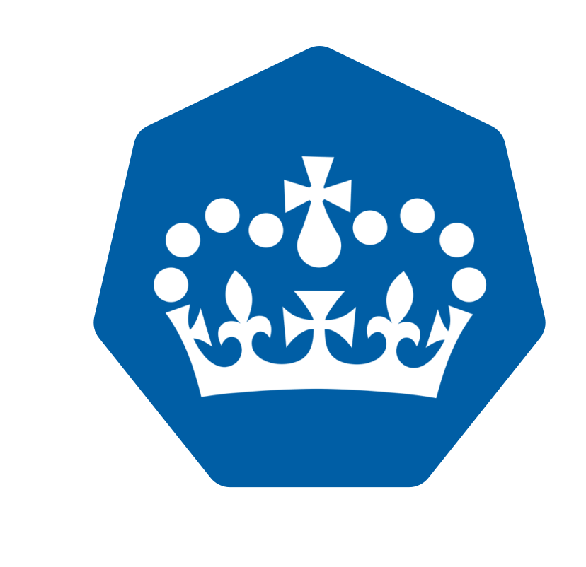
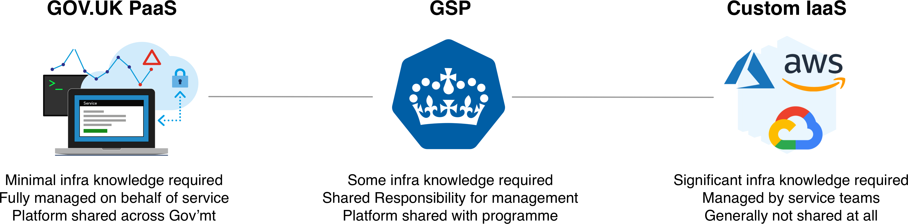

# GSP  

GSP (GDS Supported Platform) is a Kubernetes distribution maintained by the [Government Digital Service](https://www.gov.uk/government/organisations/government-digital-service) created to meet the common needs of running digital services in production.

* Reduce onboarding/support burden by sharing a consistent base and common declarative language
* Reduce costs to programmes by sharing infrastructure where possible
* Minimise vendor lock-in while leveraging managed services by using non-proprietary configuration language and abstractions
* Improve service team delivery by providing release automation and observability tooling
* Increase service team confidence in deployments by enabling strong parity between local development and production environments
* Avoid development bottlenecks and platform stagnation by encouraging all teams to extend and evolve the shared GSP base to meet emerging needs

GSP provides a suite of pre-configured components along with upstream Kubernetes, much like a GNU/Linux distribution provides a suite of userspace components along with the upstream Linux kernel.

## Features

- A declarative continuous delivery workflow - merging to master triggers deployment to production
- A container platform based on industry standard [Docker](https://docs.docker.com/) and [Kubernetes](https://kubernetes.io)
- Build and release automation powered by [ConcourseCI](https://concourse-ci.org/)
- A private container registry with [Docker Registry](https://docs.docker.com/registry/)
- Signing of docker image integrity with [Docker Notary](https://docs.docker.com/notary/)
- Scanning of docker images for security vulnerabilities with [clair](https://github.com/coreos/clair)
- Monitoring and alerting with [Prometheus](https://prometheus.io/), [Alertmanager](https://prometheus.io/docs/alerting/alertmanager/) and [Grafana](https://grafana.com/)
- Secure git-based secrets configuration with [sealed-secrets](https://github.com/bitnami-labs/sealed-secrets)
- Ingress management and service mesh with [Istio](https://istio.io/)
- Protective monitoring provided by GDS TechOps CyberSecurity with [Splunk](https://www.splunk.com/)
- Cloud infrastructure hosted on [AWS](https://aws.amazom.com) across multiple availability zones in London
- Kubernetes control plane with [AWS EKS](https://aws.amazon.com/eks/)
- An [AWS CloudHSM](https://docs.aws.amazon.com/crypto/latest/userguide/awscryp-service-hsm.html) providing secure storage for cryptographic keys

## Non goals

GSP is not a managed service.

If you are a team looking for a fully managed platform, we recommend you evaluate [GOV.UK PaaS](https://docs.cloud.service.gov.uk) before attempting to run and manage your own GSP instance. 

The platform has been designed to complement an organisation that practices a Reliability Engineering model that assumes there exists a small number of infrastructure and reliability focused members capable of supporting a much larger team or programme.

The figure above illustrates where we think GSP fits on a "PaaS Spectrum":

* On the right-hand-side we have the situation where service teams all design their deployment architectures in isolation using (hopefully) cloud managed services which gives the ultimate in flexibility at the cost of poor knowledge share across the organisation and a need for dedicated infrastructure expertise.
* On the left-hand-side we have the fully managed GOV.UK PaaS platform where a service team may not need any infrastructure expertise but at the cost of flexibility.
* Sitting between the two is GSP which is:
	* more complex for service teams compared to PaaS, in exchange for greater flexibility over the platform itself
	* more opinionated than a bespoke architecture, in exchange for greater knowledge/code sharing between teams
	* more isolated than GOV.UK PaaS, but encourages sharing as much as possible 

## Getting started

Come talk to the Automate team. We're on Slack in #re-autom8 and on the east side of the 6th floor.

You also might want to look at how other teams are using GSP:

- [Verify eIDAS proxy node](https://github.com/alphagov/verify-proxy-node/tree/master/ci)
- [Verify Document Checking Service (private repo)](https://github.com/alphagov/doc-checking)

## Contributing

Contributions encouraged!

Changes require commits signed by [GDS Trusted Developers](https://github.com/alphagov/gds-trusted-developers)

## Help and support

The platform is maintained by [GDS Reliability Engineering](https://reliability-engineering.cloudapps.digital/) and support for GDS service teams is provided according to the [Technology & Operations Shared Responsibility Model](https://reliability-engineering.cloudapps.digital/documentation/strategy-and-principles/techops-shared-responsibility-model.html)

For help or support:

- read our [documentation](/docs)
- raise an [issue](https://github.com/alphagov/gsp/issues)
- message the team on the Reliability [Engineering Slack channel](https://gds.slack.com/messages/CAD6NP598) [#reliability-eng](https://gds.slack.com/messages/CAD6NP598)

