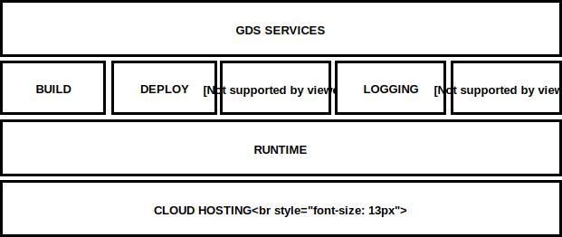

#  GDS Supported Platform Overview

## Generic View

This view shows the high level components that make up the GDS Supported Platform.

<!-- __[edit draw.io diagram](https://www.draw.io/?state=%7B%22ids%22:%5B%221ferkexNsCzQ8Dzjlfjw8O3nuQ-O1fqC2%22%5D,%22action%22:%22open%22,%22userId%22:%22104206899246339571570%22%7D#G1ferkexNsCzQ8Dzjlfjw8O3nuQ-O1fqC2)__
-->

|Component|Description|
|---------|-----------|
|`BUILD`| converts source code into deployable binary artefacts and stores it in a repository|
|`CLOUD HOSTING`| provides the underlying cloud infrastructure|
|`DEPLOY`| controls how binary artefacts are deployed|
|`GDS SERVICES`| services written by GDS service teams in a [GDS Way supported language](https://gds-way.cloudapps.digital/standards/programming-languages.html)|
|`LOGGING`| collects log infomation to allow inspection and diagnosis of a running application|
|`MONITORING AND ALERTING`| looks after the application and tells you when it is having issues|
|`PROTECTIVE MONITORING`| ensures that your service is safe and manages the cyber security risk|
|`RUNTIME`| schedules the code to be run|

## Implementation Specific View

<!-- __[edit draw.io diagram](https://www.draw.io/?page-id=57IuSGMr5HFuiTqhkUpW#G1bmlKDb62yOyPeLGsdemJwwjSU60_cYlO)__
-->

|Component|Description|
|---------|-----------|
|`Alertmanager`| techops alerting |
|`Amazon Web Services`| provides the underlying cloud infrastructure|
|`CloudWatch`| collects log infomation to allow inspection and diagnosis of a running application|
|`ConcourseCI`| is the continuous integration tool that runs  the pipelines to convert source code into container images|
|`Docker Notary`| signs and verifies docker image integrity |
|`Docker Registry`| is the private container registry that stores the buid artefacts |
|`Docker`| runs  containers |
|`Flux`| deploys released software into the kubernetes cluster|
|`GDS Services`| services written by GDS service teams in a [GDS Way supported language](https://gds-way.cloudapps.digital/standards/programming-languages.html)|
|`Grafana`| display application metrics|
|`Helm Charts`|Applications packaged for deployment using [Helm Charts](https://helm.sh/docs/developing_charts/) |
|`Kubernetes`| schedules the containers to be run
|`Prometheus`| techops monitoring |
|`Splunk`| ensures that your service is safe and manages the cyber security risk|
|`Terraform` | manages the infrastructure as code |

<!--
sources:
- the original schematic
- the eIDAS diagram in the eidas proposal
-->
